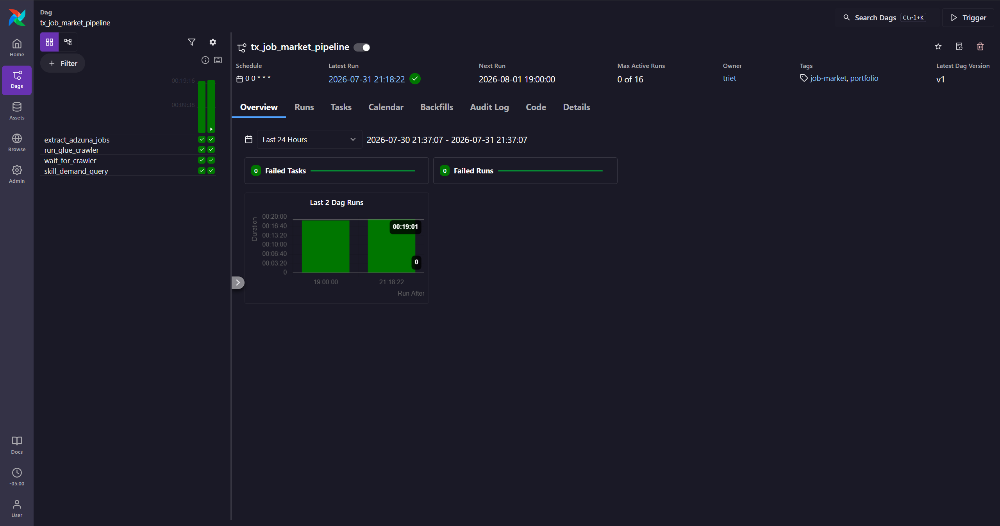
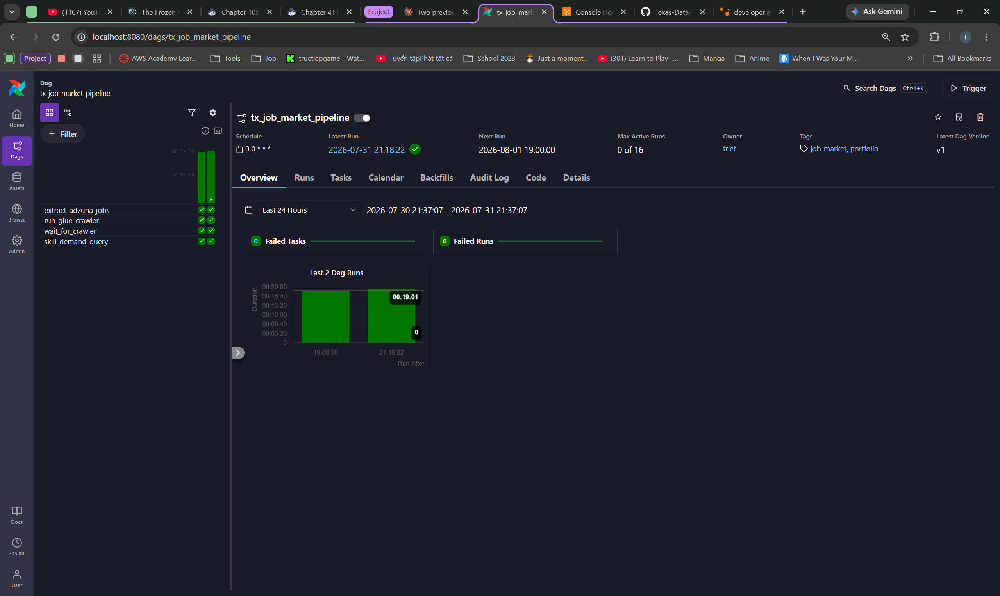
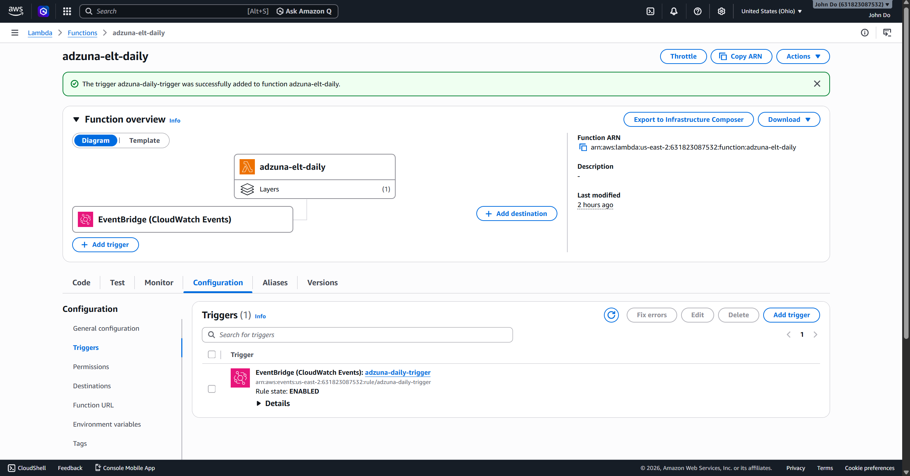
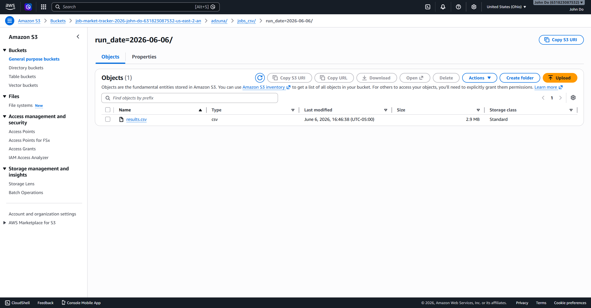
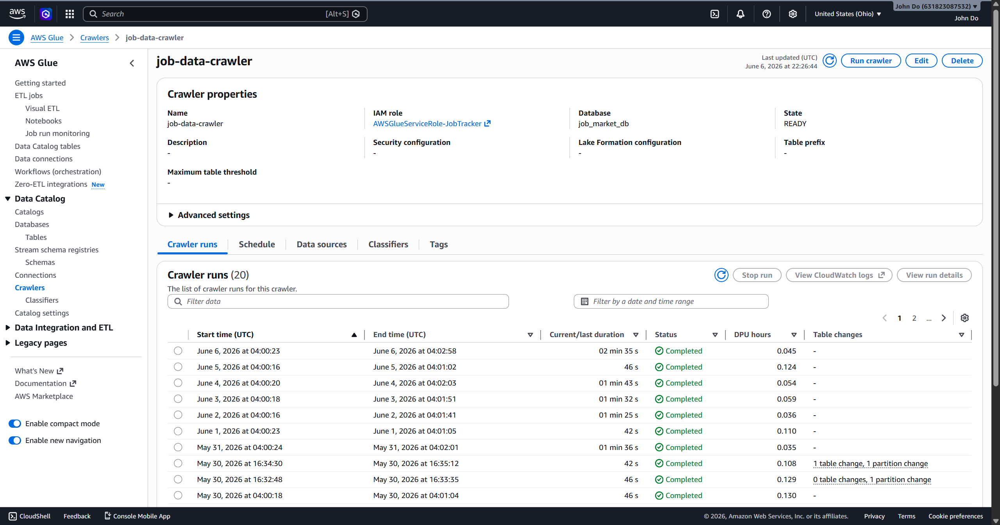
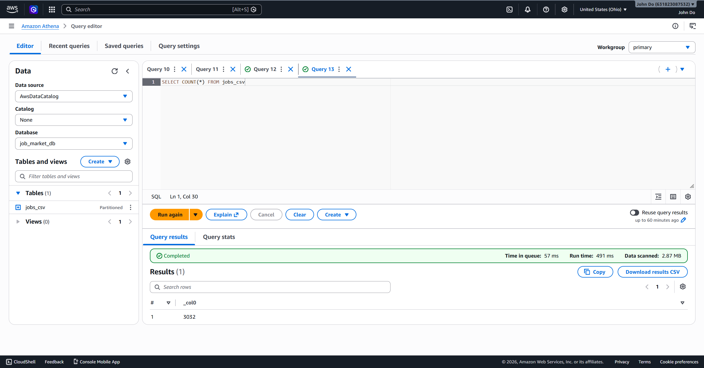
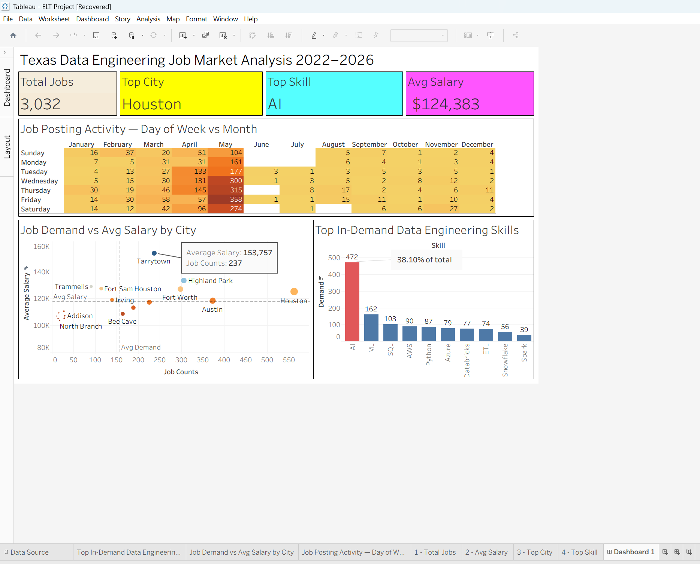

# Texas Data Engineering Job Market Analysis
### Automated ELT Pipeline + Airflow Orchestration + Tableau Dashboard

An end-to-end automated data pipeline that extracts daily job postings from the Adzuna API, stores them in AWS S3, catalogs them with AWS Glue, queries them with AWS Athena, and visualizes insights in Tableau. Orchestrated with **Apache Airflow**.

---

## Architecture

```
Apache Airflow (Astro CLI, Docker) — @daily schedule
        ↓
AWS Lambda (Python 3.11)
        ↓
Adzuna Jobs API → 3,000+ job postings
        ↓
Amazon S3 (partitioned by run_date)
        ↓
AWS Glue Crawler (auto schema detection)
        ↓
AWS Athena (SQL queries)
        ↓
Tableau Dashboard (live visualizations)
```

---

## Orchestration Evolution

Originally scheduled via **AWS EventBridge** (`cron(0 8 * * ? *)`) triggering the Lambda
directly. Migrated to **Apache Airflow** (via Astro CLI, running locally on Docker) to add
proper dependency management, retries, and observability across the pipeline:

```
extract_adzuna_jobs (Lambda)
        ↓
run_glue_crawler (Glue)
        ↓
wait_for_crawler (Glue Crawler Sensor)
        ↓
skill_demand_query (Athena)
```

Each step now only runs if the previous one succeeds, with automatic retries and a full
run history visible in the Airflow UI — instead of a single unmonitored cron trigger.



---

## Tech Stack

| Layer | Technology |
|---|---|
| Extraction | Python, Adzuna REST API |
| Orchestration | Apache Airflow (Astro CLI, Docker) — *previously AWS EventBridge* |
| Compute | AWS Lambda (Python 3.11) |
| Storage | Amazon S3 (data lake) |
| Cataloging | AWS Glue Crawler |
| Querying | AWS Athena (SQL) |
| Visualization | Tableau Desktop |
| Monitoring | AWS CloudWatch, Airflow UI (task logs, retries, run history) |

### Airflow Operators Used

| Task | Operator |
|---|---|
| Invoke Lambda extraction | `LambdaInvokeFunctionOperator` |
| Trigger Glue crawler | `GlueCrawlerOperator` |
| Wait for crawler completion | `GlueCrawlerSensor` |
| Run Athena skill-demand query | `AthenaOperator` |

DAG file: [`dags/tx_job_market_dag.py`](dags/tx_job_market_dag.py)

---

## Key Findings

From **3,032 job postings** across Texas (Dallas, Houston, Austin, San Antonio, Fort Worth):

- **AI is the #1 in-demand skill** — appearing in 38% of all postings, 2.5× more than the next skill
- **Average data engineering salary: $124,383**
- **Houston** has the most job postings (562) but mid-range salary
- **Tarrytown/Fort Worth** are the sweet spot — above average demand AND salary
- **Friday in May** is peak hiring activity (358 postings in a single cell)
- **Monday/Sunday** are the slowest posting days across all months

---

## Dashboard Visualizations

### 1. KPI Summary Cards
Total Jobs · Avg Salary · Top City · Top Skill

### 2. Top In-Demand Skills (Bar Chart)
AI (472) · ML (162) · SQL (103) · AWS (90) · Python (87) · Azure (79) · Databricks (77) · ETL (74) · Snowflake (56) · Spark (39)

### 3. Job Demand vs Avg Salary by City (Scatter Plot)
4-quadrant analysis identifying sweet spot markets using reference line averages

### 4. Job Posting Activity (Heat Map)
Day of week vs month using `DATEPART()` calculated fields — reveals peak hiring patterns

---

## Pipeline Details

### Data Extraction
- Queries 4 job categories × 5 Texas cities × 5 pages = up to 1,000 API calls per run
- Deduplicates by job ID to avoid double-counting
- Stores raw JSON + parsed CSV to S3

### S3 Structure
```
s3://job-market-tracker/
└── adzuna/
    ├── jobs_json/
    │   └── run_date=2026-06-06/
    │       └── results.json
    └── jobs_csv/
        └── run_date=2026-06-06/
            └── results.csv   ← 2.9 MB
```

### Automation
- **Orchestration**: Apache Airflow DAG (`tx_job_market_pipeline`), `@daily` schedule, running locally via Astro CLI on Docker — *previously an EventBridge rule (`cron(0 8 * * ? *)`), now retired*
- **Retries**: 2 automatic retries per task, 5-minute delay, configured at the DAG level
- **Lambda timeout**: 5 minutes
- **Lambda memory**: 256 MB (peak usage: 232 MB)
- **Execution time**: ~130 seconds per run (AWS connection read/connect timeout set to 300s in Airflow to accommodate this)

### SQL Skill Analysis
Custom SQL queries in Athena using `UNION ALL` pattern to count skill mentions across job titles and descriptions:

```sql
SELECT skill, COUNT(*) as demand
FROM (
    SELECT 'AI' as skill FROM "job_market_db"."jobs_csv"
    WHERE lower(description) LIKE '% ai %'
       OR lower(description) LIKE '%artificial intelligence%'
    UNION ALL
    SELECT 'Python' as skill FROM "job_market_db"."jobs_csv"
    WHERE lower(description) LIKE '%python%'
    -- ... additional skills
) sub
GROUP BY skill
ORDER BY demand DESC
```

---

## Screenshots

### Airflow DAG — Successful End-to-End Run



- All 4 tasks (`extract_adzuna_jobs`, `run_glue_crawler`, `wait_for_crawler`, `skill_demand_query`) succeeded
- 0 failed tasks, 0 failed runs

### Lambda Test — Successful Execution




- Status: 200
- Jobs fetched: 3,044
- Duration: 129,953 ms

### S3 Data Lake — Partitioned Storage



- File: `results.csv` (2.9 MB)
- Partition: `run_date=2026-06-06`

### Glue Crawler — 20 Successful Runs



- Running daily since May 30, 2026
- All runs completed successfully

### Athena Query — Live Data Verification



- `SELECT COUNT(*) FROM jobs_csv` → 3,032 rows
- Query time: 491ms, Data scanned: 2.87 MB

### Tableau Dashboard



---

## Project Setup

### Prerequisites
- AWS account with Lambda, S3, Glue, Athena access
- Adzuna API credentials (free at developer.adzuna.com)
- Tableau Desktop
- Docker Desktop + [Astro CLI](https://www.astronomer.io/docs/astro/cli/install-cli) (for running the Airflow orchestration layer locally)

### Environment Variables (Lambda)
```
ADZUNA_APP_ID=your_app_id
ADZUNA_APP_KEY=your_app_key
S3_BUCKET=your_bucket_name
```

### Lambda Layer
```
arn:aws:lambda:us-east-2:336392948345:layer:AWSSDKPandas-Python311:31
```

### Running the Airflow DAG Locally
```bash
astro dev init      # first time only
astro dev start
```
Then create an `aws_default` connection in the Airflow UI (`localhost:8080` → Admin → Connections) with your AWS credentials, and set the Extra field to:
```json
{"region_name": "us-east-2", "config_kwargs": {"read_timeout": 300, "connect_timeout": 300}}
```
Place `tx_job_market_dag.py` in the `dags/` folder — Airflow will auto-detect it.

---

## Repository Structure

```
├── README.md
├── lambda_function.py          ← Main ETL script (Lambda entry point)
├── requirements.txt            ← Python dependencies
├── dags/
│   └── tx_job_market_dag.py    ← Airflow DAG: Lambda → Glue → Athena
├── sql/
│   └── skill_demand_queries.sql ← Athena SQL for Tableau
└── screenshots/
    ├── airflow_dag_success.png
    ├── lambda_test_success.png
    ├── s3_partitioned_data.png
    ├── glue_crawler_runs.png
    ├── athena_count_query.png
    └── tableau_dashboard.png
```
